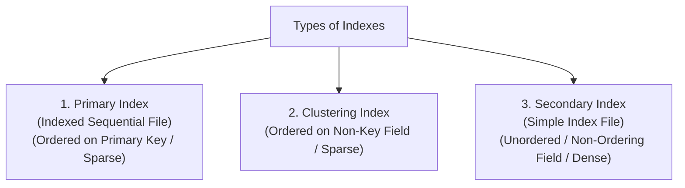

# 06 - Indexing Techniques

**Unit 6 · CEM2003C Data Structures** · [← File Structure & Organization](05-file-structure-and-organization.md) · [Next: Important Questions →](important-questions.md)

> **Source note:** Based on Chapter 6 (`Unit 6: Hashing & File Structure`), slides 43–54 of the faculty study material. Covers indexing concepts, storage and search calculations, and the three index classifications: **Primary Indexes (Indexed Sequential Files)**, **Clustering Indexes**, and **Secondary Indexes (Simple Index Files)**.

---

## What is Indexing? (Slide 43)

- **Definition:** **Indexing** is a technique used to significantly speed up the retrieval of records from large files stored on secondary storage.
- **Index File Structure:** Indexing is implemented using a separate, auxiliary sequential file called an **Index File**.
- **Index Entry Format:** Each record in the index file consists of exactly **two fields**:
  1. **Key Field:** Contains a search key value.
  2. **Pointer Field:** Stores the physical block or record address pointing into the main data file.

```text
+-------------------+--------------------+
|  Search Key Field | Disk Block Pointer |
+-------------------+--------------------+
```

### Retrieval Process:
To locate a specific record:
1. The compact index file is searched for the target key value using **Binary Search**.
2. The extracted pointer directly retrieves the corresponding record from the main data file.

---

## Indexing Architecture Diagram (Slide 44)

An index file ordered on `Roll No.` pointing into an **unsorted Main Data File**:

```text
INDEX FILE (Sorted on Key)                    MAIN DATA FILE (Unsorted)
+----------+---------+                        +----------+----------+------+-------+
| Key Field| Pointer |                        | Name     | Roll No. | Year | Marks |
+----------+---------+                        +----------+----------+------+-------+
| 1000     |    •────┼───────────────────────>| JITENDRA | 1000     | 1    | 75    |
+----------+---------+                        +----------+----------+------+-------+
| 1009     |    •────┼───────────────────┐    | RAVI     | 1012     | 1    | 79    |
+----------+---------+                   │    +----------+----------+------+-------+
| 1010     |    •────┼──────────────┐    │    | AMIT     | 1010     | 1    | 82    |
+----------+---------+              │    │    +----------+----------+------+-------+
| 1012     |    •────┼─────────┐    │    │    | KALPESH  | 1016     | 1    | 54    |
+----------+---------+         │    │    │    +----------+----------+------+-------+
| 1016     |    •────┼────┐    │    │    └───>| UMESH    | 1009     | 1    | 74    |
+----------+---------+    │    │    │         +----------+----------+------+-------+
| 1089     |    •────┼──┐ │    │    └────────>| NILESH   | 1089     | 1    | 85    |
+----------+---------+  │ │    │              +----------+----------+------+-------+
| 1100     |    •────┼┐ │ │    └─────────────>| NITIN    | 1100     | 1    | 98    |
+----------+---------+│ │ │                   +----------+----------+------+-------+
| 1200     |    •────┼┼─┼─┼──────────────────>| JAYESH   | 1200     | 1    | 99    |
+----------+---------+│ │ │                   +----------+----------+------+-------+
```

---

## Advantages of Indexing (Slides 45–47)

1. **Multi-Field Searching:** Multiple independent indexes can be constructed for different attributes of the same data file, providing complete querying flexibility.
2. **Reduced Storage Overhead:** Because index entries contain only a key and a pointer ($V + P$), the index file occupies substantially less disk space than the full data file.
3. **Fewer Block Accesses:** Searching a small index file requires significantly fewer disk I/O operations than searching the full data file.
4. **Fast Insertions:** New data records can simply be appended to the end of the main file without expensive record shifting.

---

## Course Worked Example: Storage & Search Access Comparison (Slide 46)

### Scenario Parameters:
- **Total Records:** $N = 1024$ records
- **Data Record Size:** $R = 128 \text{ bytes}$
- **Disk Block Size:** $B = 2048 \text{ bytes}$
- **Index Key Field Size ($V$):** $4 \text{ bytes}$
- **Block Pointer Size ($P$):** $4 \text{ bytes}$

---

### 1. Sequential Data File (Without Index):
- **Total File Size:** $1024 \times 128 = 131,072 \text{ bytes}$
- **Number of Data Blocks Required:**
  $$\mathbf{\text{Blocks} = \frac{1024 \times 128}{2048} = 64 \text{ blocks}}$$
- **Block Accesses for Binary Search:**
  $$\mathbf{\log_2 64 = 6 \text{ block accesses}}$$

---

### 2. Auxiliary Index File:
- **Size of One Index Entry:** $V + P = 4 + 4 = \mathbf{8 \text{ bytes}}$
- **Total Index Entries:** $1024$ entries
- **Total Index File Size:** $1024 \times 8 = 8,192 \text{ bytes}$
- **Number of Index Blocks Required:**
  $$\mathbf{\text{Index Blocks} = \frac{1024 \times 8}{2048} = 4 \text{ blocks}}$$
- **Block Accesses for Searching Index:**
  $$\mathbf{\log_2 4 = 2 \text{ block accesses}}$$
- **Total Accesses (Index Search + Main Record Retrieval):** $2 + 1 = \mathbf{3 \text{ block accesses}}$ (a **50% reduction** in disk I/O compared to 6 accesses).

---

## Types of Indexes (Slides 47–54)

The faculty curriculum defines three fundamental types of indexes:



---

### 1. Primary Indexes / Indexed Sequential File (Slides 48–49)

- **Definition:** An **Indexed Sequential File** is a data file that is **both ordered and indexed** on its primary key.
- **Organization:**
  - The main data file is **physically sorted** on the primary key field.
  - The index file is **Sparse**: it stores **one entry for each disk block** (typically storing the first key of each block, known as the *anchor key*).
- **Index Fields:** Key field value + Block pointer.

```text
INDEX FILE (Sparse)                      DATA FILE (Sequential & Ordered)
+----------+---------+                   BLOCK 1
| Key      | Pointer |                   +----------+--------------------------+
+----------+---------+                   | 101      | (Record data...)         |
| 101      |    •────┼──────────────────>| 200      | (Record data...)         |
+----------+---------+                   +----------+--------------------------+
| 201      |    •────┼──────────┐        BLOCK 2
+----------+---------+          │        +----------+--------------------------+
| 351      |    •────┼─────┐    └───────>| 201      | (Record data...)         |
+----------+---------+     │             | 350      | (Record data...)         |
| :        |    :    |     │             +----------+--------------------------+
+----------+---------+     │             BLOCK 3
| 805      |    •────┼┐    │             +----------+--------------------------+
+----------+---------+│    └────────────>| 351      | (Record data...)         |
| 905      |    •────┼┼────────┐         | 400      | (Record data...)         |
+----------+---------+│        │         +----------+--------------------------+
```

---

### 2. Clustering Indexes (Slides 50–51)

- **Definition:** A **Clustering Index** is created when the records of the data file are **physically ordered on a non-key field**.
- **Non-Key Property:** A non-key field does not have distinct values for each record; multiple records share identical field values (e.g., `Department`, `Course Code`).
- **Organization:**
  - Records sharing the same non-key value are clustered together in contiguous disk blocks.
  - The index file contains an entry for each distinct non-key value pointing to the **first block** containing that cluster.

```text
INDEX FILE (Clustering)                  CLUSTERED DATA FILE (Ordered on Dept ID)
+----------+---------+                   BLOCK 1
| Dept ID  | Pointer |                   +----------+--------------------------+
+----------+---------+                   | 100      | Math                     |
| 100      |    •────┼──────────────────>| 100      | Science                  |
+----------+---------+                   | 105      | Physics                  |
| 105      |    •────┼──────────┐        +----------+--------------------------+
+----------+---------+          │        BLOCK 2
| 106      |    •────┼─────┐    │        +----------+--------------------------+
+----------+---------+     │    └───────>| 105      | (Physics continued...)   |
| 108      |    •────┼┐    │             | 105      |                          |
+----------+---------+│    │             +----------+--------------------------+
                      │    │             BLOCK 3
                      │    │             +----------+--------------------------+
                      │    └────────────>| 106      |                          |
                      │                  | 106      |                          |
                      │                  +----------+--------------------------+
```

---

### 3. Secondary Indexes / Simple Index File (Slides 52–54)

- **Motivation:** While hashed and indexed sequential files support fast searches on the ordering key, they cannot accelerate searches on other attributes. To search efficiently on non-ordering fields, **Secondary Indexes** are maintained.
- **Organization:**
  - Created on a **non-ordering field** of the data file (where the data file is unsorted or sorted on a different field).
  - The index is **Dense**: it contains **an explicit index entry for every individual record** in the data file.
- **Fields:** Non-ordering search key value + Record/Block pointer.

```text
SECONDARY INDEX (Dense / Ordered)        DATA FILE (Unsorted on this field)
+----------+---------+                   BLOCK 1
| Key      | Pointer |                   +----------+--------------------------+
+----------+---------+                   | 2        |                          |
| 1        |    •────┼──────────────┐    | 5        |                          |
+----------+---------+              │    | 3        |                          |
| 2        |    •────┼─────────┐    │    | 17       |                          |
+----------+---------+         │    │    +----------+--------------------------+
| 3        |    •────┼──────┐  │    │    BLOCK 2
+----------+---------+      │  │    │    +----------+--------------------------+
| 4        |    •────┼────┐ │  │    │    | 6        |                          |
+----------+---------+    │ │  │    └───>| 1        |                          |
| :        |    :    |    │ │  │         +----------+--------------------------+
```

---

## Comparison of Index Types (Slide 54)

| Feature | Primary Index | Clustering Index | Secondary Index |
|---|---|---|---|
| **Data File Ordering** | Ordered on Primary Key | Ordered on Non-Key Field | Unordered (or ordered on a different key) |
| **Index Density** | **Sparse** (One entry per block) | **Sparse** (One entry per distinct cluster value) | **Dense** (One entry per record) |
| **Number of Indexes** | Exactly **one** per file | At most **one** per file | **Multiple** indexes can be maintained |
| **Storage Space** | Very small | Moderate | Larger (stores entry for every record) |
| **Search Time** | Fast ($\log_2 \text{Index Blocks} + 1$) | Fast | Slightly longer due to denser index file |

**Next:** [Important Questions](important-questions.md)
