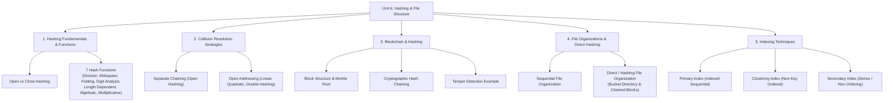

# Unit 6 - Hashing and File Structure

> **CEM2003C | Data Structures | Semester 3**

Unit 6 covers fast data access and persistent storage techniques: hashing concepts and search time complexities, hash table architectures (Open Hashing / external hashing vs Close Hashing / internal hashing), 7 distinct hash function methods, collision resolution strategies (Separate Chaining and Open Addressing with Linear Probing, Quadratic Probing, and Double Hashing), applications of hashing in Blockchain (block structure, hash chains, linked list analogy, and tampering detection), file structures and primitive operations, sequential file organization, direct/hashing file organization with bucket directories, and indexing techniques (Primary, Clustering, and Secondary indexes).

> **Source note:** Core Unit 6 concepts, definitions, examples, methods, and terminology are based on the faculty `Unit 6: Hashing & File Structure` study material (CEM2003C). Any additional explanatory material is clearly identified as supplementary.

---

## Unit roadmap

---

## Topic-wise notes

| No. | Topic | Open notes |
|---:|---|---|
| 1 | Hashing and Hash Table Data Structures | [Start](01-hashing-and-hash-table.md) |
| 2 | Hashing Functions and Calculation Methods | [Start](02-hashing-functions.md) |
| 3 | Collision Resolution Strategies | [Start](03-collision-resolution.md) |
| 4 | Introduction to Blockchain and Hashing | [Start](04-blockchain-and-hashing.md) |
| 5 | File Structure and File Organizations | [Start](05-file-structure-and-organization.md) |
| 6 | Indexing Techniques (Primary, Clustering, Secondary) | [Start](06-indexing.md) |

---

## Exam support

- [Important Questions](important-questions.md)
- [Viva Questions](viva-questions.md)

---

## Learning checklist

- [ ] Explain why hashing provides $O(1)$ average search time without requiring sorted data.
- [ ] Differentiate **Open Hashing (external hashing)** and **Close Hashing (internal hashing)**.
- [ ] Calculate hash addresses using **Division**, **Midsquare**, **Folding (Fold-shifting & Fold-boundary)**, **Digit Analysis**, **Length Dependent**, **Algebraic Coding**, and **Multiplicative Hashing**.
- [ ] Resolve collisions using **Separate Chaining** with bucket linked lists.
- [ ] Trace open addressing collisions using **Linear Probing** (with primary clustering), **Quadratic Probing**, and **Double Hashing**.
- [ ] Explain the structure of a blockchain block (Previous Hash, Timestamp, Nonce, Merkle Root) and illustrate how hash pointer chains detect data tampering.
- [ ] Define files, records, fields, and list the 6 primitive file operations.
- [ ] Analyze the advantages, disadvantages, and block access costs of **Sequential Files** ($\log_2 b$).
- [ ] Calculate average block accesses in **Direct / Hashing File Organization** using bucket directories.
- [ ] Compare **Primary Index (Sparse)**, **Clustering Index**, and **Secondary Index (Dense)** in terms of ordering, storage overhead, and search performance.

---

**Previous:** [Unit 5 - Graphs](../Unit-5-Graphs/)  
**Course Index:** [Main Repository README](../README.md)
